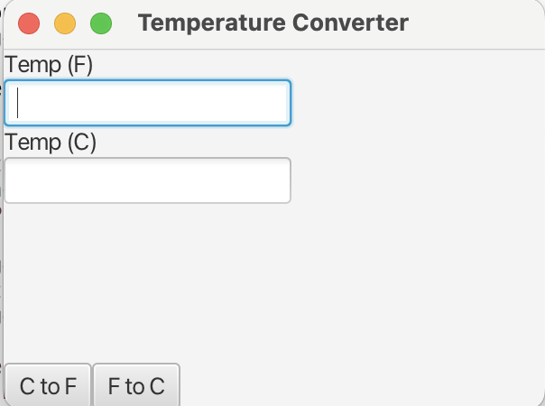
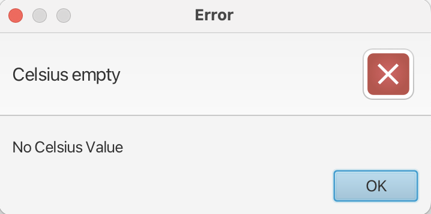

# csc335-GUI-lab

For this lab, you'll be making a small GUI application to convert temperatures between the Fahrenheit and Celsius scales.

Recall the formulae for conversion:

	°F = (x − 32) × ⁠5/9⁠ °C 	
	°C = (x × ⁠9/5⁠ + 32) °F 
	
Make your UI out of two `Label`s, two `TextField`s, and two `Button`s as shown:

Make a `VBox` to hold the first label and textfield. Add this to the top of a `BorderPane`
Make a second `VBox` to hold the second label and textfield. Add this to the center.
Make a `HBox` to put the two buttons next to each other and add it the the bottom of the `BorderPane`.

When the appropriate button is clicked, get the text from the corresponding field, parse a number out of it (float), and set the text of the appropriate box to be the converted value:

If the input textbox is empty, display an `Alert`:

You can use the code from lab 1 to see how to make an Alert box and show it.

